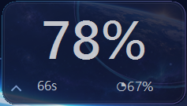
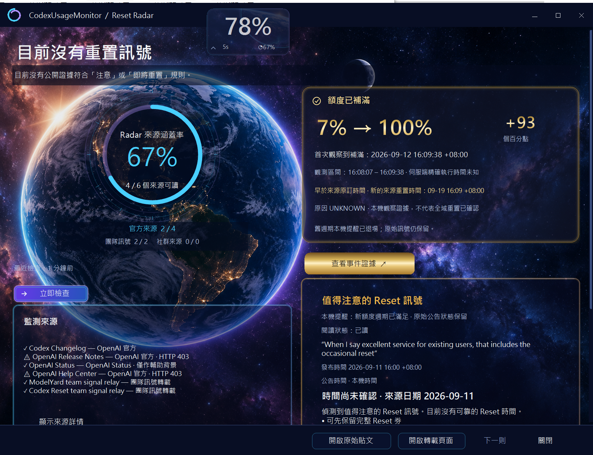
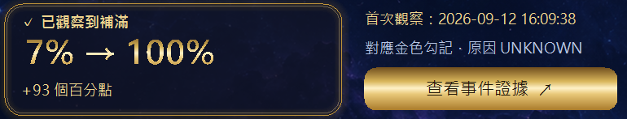
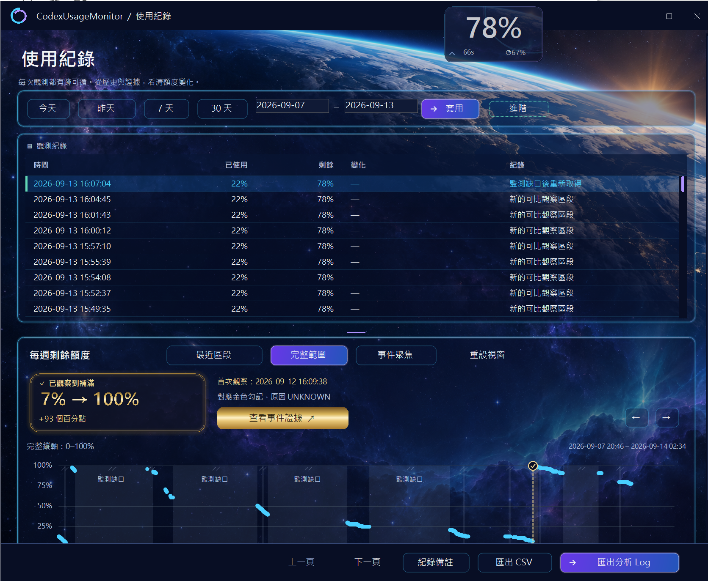
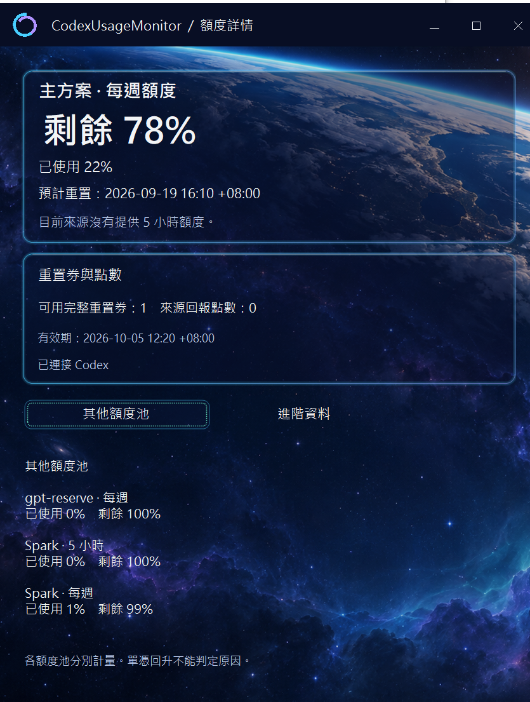
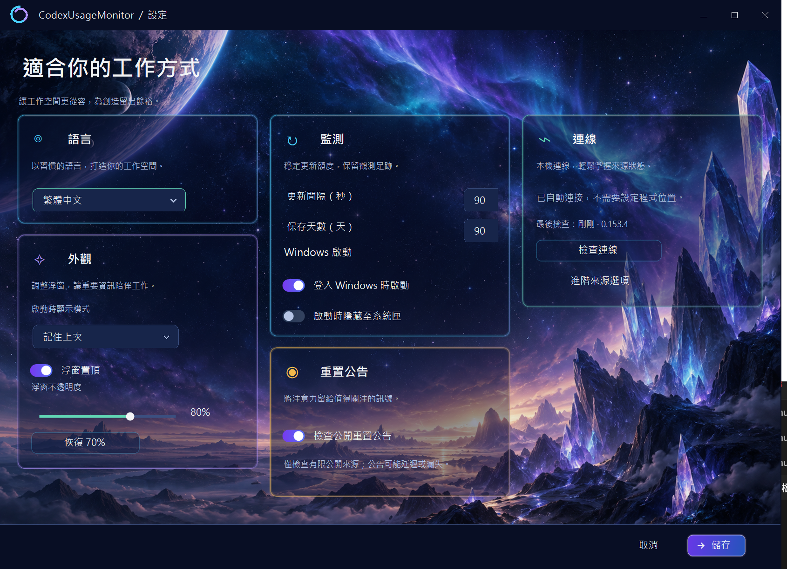

# CodexUsageMonitor

**Your weekly Codex quota, quietly on your desktop.**

English · [繁體中文](README.zh-TW.md)

[Download v0.4.1 for Windows x64](https://github.com/hayabusasean/CodexUsageMonitor/releases/tag/v0.4.1) · [Read the reset story](docs/stories/first-reset.en.md) · [Report a bug](https://github.com/hayabusasean/CodexUsageMonitor/issues)

I was opening the Usage page far too often, so I made a small Windows companion. It shows the weekly quota I have left, keeps local history, and watches a few public sources for reset-related news.

Free and open source. English by default, with a Traditional Chinese switch. This is an unofficial community project, not an OpenAI product.

## Start here

Install and sign in to the official Codex first. Then download **`CodexUsageMonitor-v0.4.1-win-x64.zip`** from the release page, extract the whole folder, and run **`CodexUsageMonitor.exe`**. No installer or API key is required by this tool. GitHub's **Source code** archives are for building the project, not the ready-to-run app.

Drag the overlay to move it. Use its small corner control to switch views, or right-click for history, reset announcements and settings. The seconds count down to the **next quota check**, not a promised reset. Data stays in `%LOCALAPPDATA%\CodexUsageMonitor`, separately from the EXE folder.

To update, exit the old monitor from its menu before opening the new EXE. Starting another copy does not upgrade the running process; the app protects the existing history writer. Keep your local data folder to retain history and settings.

## What the Gold release adds

The space-themed interface now uses translucent panels and small champagne-gold accents. Significant replenishments get a gold summary **outside the chart**, so you can find the event without covering the data.

History has recent-segment, full-range and event-focused views, with time navigation, a resizable table/chart split, notes, CSV and detailed analysis-log exports. Small changes remain readable, while observation gaps stay visible instead of being filled with invented values.

Reset Radar separates unread notices from still-active signals. Relevant old-cycle reminders retire after a matching local replenishment; the original message and its source remain available. The release also fixes repeated History redraws, Details refresh/sizing issues, and confusing launches of different builds.

*Real author screenshot from September 13, looking back at the September 12 event. The UI supports English; this screenshot uses Traditional Chinese.*

## The first reset I watched with it

The yellow light was on, and I held off on using my remaining reset credit. Later, people in a Codex Facebook group shared more specific news. My quota went down to **7%**, then the monitor showed **100%**. The credit was still there.

That felt pretty good. 😄

The tool did **not** predict the reset time. More specific information came from the community, and the tool did not demonstrate a timely red INCOMING alert for that update. What it did give me was a useful nudge and a record of the change.

[See the original screenshots and the short timeline →](docs/stories/first-reset.en.md)

## What the lights and numbers mean

| Indicator | Meaning |
| --- | --- |
| Large percentage | Weekly quota remaining; its low-quota colours are separate from the radar. |
| Small seconds count | Time until the next quota read, or a labelled retry state. |
| Radar percentage | Readability of the **configured sources**, not the probability of a reset. |
| Amber `!` / dot | A new / already-read but active WATCH signal. Check the source and community follow-ups. |
| Red `!` / dot | A new / already-read but active INCOMING signal with more explicit information. Not a guarantee for your account. |
| Gold event card | A local replenishment was observed. It does not prove its global cause. |

For example, **67%** in these screenshots means **4 of 6 configured sources** were readable. It does not mean 67% of the internet was searched, nor a 67% chance of a reset. Two relays repeating one post are still one underlying claim.

## More of the app

Usage history and the gold event summary

The full screenshot preserves the author's visible window, including the scrolled lower chart. No values or missing data were edited.

Quota details and settings

Screenshots show the author's preferences, not necessarily the defaults.

## Privacy and limits

Quota reads go through a locally installed official Codex app-server. The monitor itself does not ask you for an API key, read browser cookies or directly read `auth.json`. The official Codex process uses its own sign-in. Monitoring does not start model turns, spend reset credits or purchase quota.

Local history and exports stay on your machine unless you choose to share them. Public-source checks make normal HTTPS requests to their hosts; those hosts can see ordinary request information. There is no app telemetry, but detailed logs can still contain sensitive account context or usage patterns—review them before sharing.

Radar coverage is limited. Sources can block requests, change format or relay news late; a healthy response does not guarantee the latest post is present. Windows x64 is the target. Earlier rc.3 was used on Windows 11 for a full workday; that is not a claim that every Gold build, DPI or multi-monitor setup was retested. The EXE is unsigned, so Windows may show a warning. Verify the publisher/source and release checksum; do not disable your security controls.

[Privacy, sources and limitations](docs/privacy-and-limits.en.md) · [Changelog](CHANGELOG.md)

## Built with help

This is my first project shared on GitHub. I described what I wanted, tried the results and asked for changes. Codex handled most of the implementation, fixes, packaging and upload work.

I use it myself. New features are paused for now; bug reports are welcome, but this is a personal project, not a supported service.

## License

[MIT](LICENSE) · Copyright (c) 2026 hayabusasean. Third-party notices retain their own terms.

Not affiliated with, endorsed by or sponsored by OpenAI.
