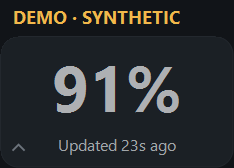
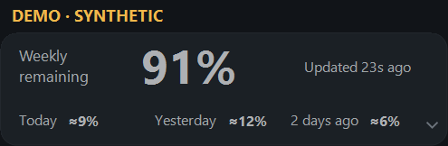
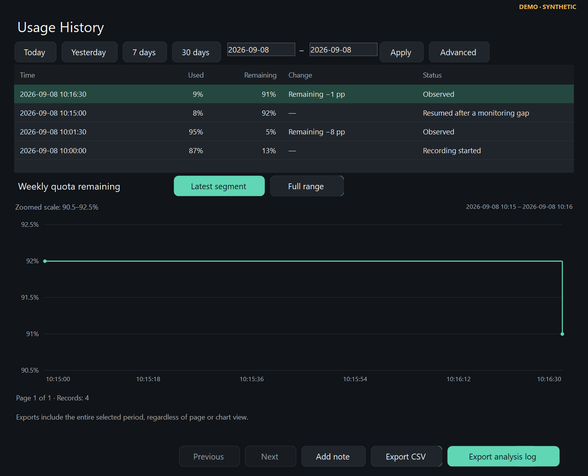

# CodexUsageMonitor

**English** | [繁體中文](README.zh-TW.md)

A tiny Windows companion for people who use Codex a little too much. 😄

Keep your weekly Codex quota, recent usage, local history and reset signals in view without repeatedly opening the Usage page.

**[Download v0.4.0-rc.3 for Windows x64](https://github.com/hayabusasean/CodexUsageMonitor/releases/download/v0.4.0-rc.3/CodexUsageMonitor-v0.4.0-rc.3-win-x64.zip)** · [Release notes](https://github.com/hayabusasean/CodexUsageMonitor/releases/tag/v0.4.0-rc.3) · [SHA256SUMS.txt](https://github.com/hayabusasean/CodexUsageMonitor/releases/download/v0.4.0-rc.3/SHA256SUMS.txt)

This is the first public **pre-release**. It is portable, unsigned and free under the MIT License. It has no telemetry and keeps history on your computer.

*The screenshots show the native Windows app with labelled example data.*

## Why I built it

I use Codex heavily for software and game development. I kept opening the Usage page to ask the same question: “How much weekly quota do I have left?”

Eventually I thought: why shouldn't that number just live quietly on my desktop?

So I built a small floating monitor. Then one morning, after working my weekly balance down from 100% to roughly 74%, I opened the monitor on another computer and saw 100% again. My first reaction was: “Did I break my own app?”

The timing aligned closely with a public OpenAI reset announcement. That experience led to local history and a lightweight Reset Radar, so I could look back at what the monitor actually observed.

A local balance change and a public announcement are separate pieces of evidence. Their timing does not prove what caused a particular account's change. The app keeps that distinction visible. History remains local to each computer; it does not sync between them.

I'm sharing this for other people who would rather stay focused on their work than keep checking a quota page.

## What it does

- Keeps a small always-on-top window in **Standard** or **Compact** mode.
- Shows weekly remaining quota and how many seconds have passed since the last update.
- Estimates usage for today, yesterday and two days ago from comparable local observations.
- Saves local history, with **Latest segment** and **Full range** chart views, monitoring gaps and CSV export.
- Records observed replenishments and resets without assuming their cause.
- Provides **Reset Radar Lite** for a limited set of public sources, distinguishing reset announcements, credit grants and general explanations.
- Exports a detailed analysis Log with an embedded prompt and structured evidence. UI and report languages can be selected independently.
- Switches between **English and Traditional Chinese** in one portable EXE.

## Get started

1. Download the Windows x64 portable ZIP linked above.
2. Extract it to a folder you can write to.
3. Open **CodexUsageMonitor.exe**.

Have a compatible official Codex installation already installed and signed in. You do not need a separate .NET runtime, SDK, PowerShell script or API key to use the portable app. GitHub's automatically generated **Source code** ZIP is for developers, not the runnable app.

Choose the UI language in **Settings** or the window's context menu. The analysis Log export window has its own language selection.

To update manually, quit the monitor, replace the EXE with the new release and reopen it. History and settings remain in **%LOCALAPPDATA%\CodexUsageMonitor**. If you move the EXE, an enabled startup shortcut is repaired on the next manual launch.

## Privacy and safety

The monitor uses read-only account interfaces exposed by the locally installed official Codex app-server. It does **not** read **auth.json**, browser cookies, project source files or conversations. It does not ask for an API key or store Codex credentials.

It does not start model turns, consume reset credits, buy credits or send telemetry. The official app-server still manages its own authentication and network activity. Reset Radar makes ordinary HTTPS requests to public sources; it does not bypass access restrictions.

Local history stays on your computer. Analysis Logs are redacted, but their usage amounts and timestamps can still reveal work patterns. Notes are off by default. Review a Log before sharing it; the smaller **About** diagnostic summary is usually a better starting point for a bug report.

See [PRIVACY.md](PRIVACY.md) and [SECURITY.md](SECURITY.md) for details.

## Compatibility and limitations

- **Tested:** Windows 10 Home 22H2 x64 at 150% display scale, including the final EXE, native bilingual UI and real quota integration.
- **Not yet tested:** Windows 11 for this release, ARM64 and other physical display scales. The verified Codex baseline was 0.153.4; changes to its interfaces may affect compatibility.
- Daily figures are estimates from observed decreases, not billing totals or a complete account ledger. Time when the monitor is closed can leave gaps.
- Radar covers a limited set of sources. A source such as the OpenAI Help Center may reject automated requests; a successful HTTP response does not itself mean a relevant announcement was found. A reset observation does not establish account-level causation.
- The EXE is **unsigned**, so Windows or SmartScreen may show a warning. Follow your computer's security policy. Checksums help compare downloaded files; they are not a security certification or proof of publisher identity.
- This is a pre-release personal utility, with best-effort support. It does not provide Codex accounts, free compute or reset coupons.

## Feedback, source and license

[Report a bug](https://github.com/hayabusasean/CodexUsageMonitor/issues/new?template=bug_report.yml) · [Contribute](CONTRIBUTING.md) · [Changelog](CHANGELOG.md)

**MIT License — Copyright (c) 2026 hayabusasean.** See [LICENSE](LICENSE).

The bundled About text predates publication; the repository's LICENSE is authoritative.

CodexUsageMonitor is an unofficial community project. **Not affiliated with, endorsed by, or sponsored by OpenAI.**
