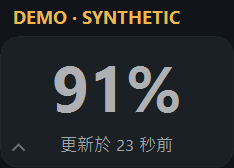
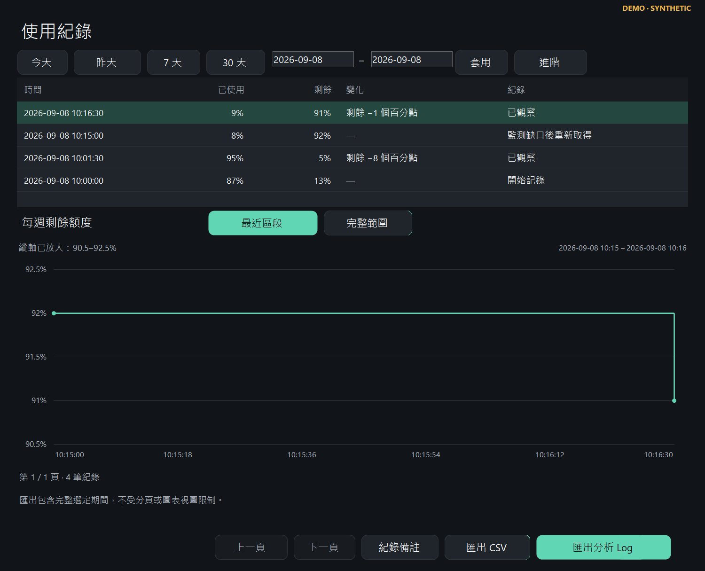

# CodexUsageMonitor

[English](README.md) | **繁體中文**

給 Codex 用得有點多的人，一個小小的 Windows 桌面夥伴。😄

讓每週剩餘額度、近期用量、本機歷史與重置訊息留在眼前，不必一直打開 Usage 頁面。

**[下載 v0.4.0-rc.3 Windows x64 可攜版](https://github.com/hayabusasean/CodexUsageMonitor/releases/download/v0.4.0-rc.3/CodexUsageMonitor-v0.4.0-rc.3-win-x64.zip)** · [版本說明](https://github.com/hayabusasean/CodexUsageMonitor/releases/tag/v0.4.0-rc.3) · [SHA256SUMS.txt](https://github.com/hayabusasean/CodexUsageMonitor/releases/download/v0.4.0-rc.3/SHA256SUMS.txt)

這是首次公開的**預發行版**，採 MIT 授權、免費提供。程式可攜、尚未數位簽章，沒有遙測，歷史紀錄留在你的電腦上。

*本文截圖來自原生 Windows 程式，畫面中的資料已標示為示範資料。*

## 為什麼做這個工具

我經常用 Codex 開發軟體和遊戲，卻也經常打開 Usage 頁面，問同一個問題：「這週到底還剩多少額度？」

後來我想，這個數字為什麼不能安靜地待在桌面上就好？

於是做了這個小浮窗。某天早上，我前一天已經把每週剩餘額度從 100% 用到大約 74%，換到另一台電腦開啟監測器，卻又看見 100%。第一個反應是：「我是不是把自己的程式寫壞了？」

後來發現，時間和 OpenAI 公開的重置公告很接近。這段經驗讓我加入本機歷史和輕量的 Reset Radar，方便回頭看監測器當時真正觀察到了什麼。

本機額度變化和公開公告是兩份不同的證據。時間接近，不代表已經證明某個帳號的額度為什麼改變；程式會保留這個區別。歷史也只留在各自的電腦，不會跨電腦同步。

現在把它分享出來，希望同樣常用 Codex 的人，可以少看幾次額度頁，多留一點注意力給手上的工作。

## 可以做什麼

- 以**標準／精簡模式**顯示小型置頂浮窗。
- 顯示每週剩餘額度，以及距離上次更新經過幾秒。
- 根據可比較的本機觀測，估計今天、昨天、前天的用量。
- 保留本機歷史，提供**最近區段／完整範圍**圖表、監測空窗提示及 CSV 匯出。
- 記錄觀察到的補充或重置，不直接推定原因。
- 用 **Reset Radar Lite** 查看有限公開來源，區分重置公告、重置券發放與一般機制說明。
- 匯出內嵌分析 Prompt 與結構化證據的詳細 Log；報告語言可與介面語言分開選擇。
- 在同一個可攜 EXE 中切換**英文／繁體中文**。

## 開始使用

1. 下載上方的 Windows x64 可攜 ZIP。
2. 解壓到你有寫入權限的資料夾。
3. 開啟 **CodexUsageMonitor.exe**。

電腦上需已有相容的官方 Codex，並完成登入。使用可攜版不必另外安裝 .NET Runtime、SDK，也不需要執行 PowerShell 腳本或提供 API Key。GitHub 自動產生的 **Source code** ZIP 是原始碼，不是可直接執行的程式包。

介面語言可在**設定**或浮窗右鍵選單切換；分析 Log 匯出視窗另有獨立的語言選項。

手動更新時，先結束監測器、替換 EXE，再重新開啟。歷史和設定仍保存在 **%LOCALAPPDATA%\CodexUsageMonitor**。若搬動 EXE，已啟用的開機啟動捷徑會在下次手動開啟時修復。

## 隱私與安全

監測器透過本機官方 Codex app-server 提供的唯讀帳號介面取得額度。它**不會讀取 auth.json、瀏覽器 Cookie、專案原始碼或對話內容**，不要求 API Key，也不儲存 Codex 憑證。

它不會啟動模型回合、使用重置券、購買額度或傳送遙測。官方 app-server 仍自行處理登入與網路行為。Reset Radar 只向公開來源發出一般 HTTPS 請求，不繞過存取限制。

歷史留在本機。分析 Log 雖然會去識別，額度數值與時間仍可能透露工作習慣；備註預設關閉。分享前請先檢查內容，回報問題通常可以先用**關於**中的較精簡診斷摘要。

詳見 [PRIVACY.md](PRIVACY.md) 與 [SECURITY.md](SECURITY.md)。

## 相容性與限制

- **已實測：**Windows 10 Home 22H2 x64、150% 顯示縮放，包含最終 EXE、原生雙語介面及真實額度串接。
- **尚未實測：**本版在 Windows 11、ARM64 及其他實體顯示縮放環境的表現。已驗證的 Codex 基準版本為 0.153.4；其介面後續變更可能影響相容性。
- 每日數字是根據觀察到的額度下降所做的估計，不是帳單或完整帳號用量帳本；程式關閉期間可能留下紀錄空窗。
- Radar 只涵蓋有限來源。OpenAI Help Center 等來源可能拒絕自動請求；HTTP 成功也不等於找到相關公告。觀察到重置，不代表已證明帳號變化的原因。
- EXE **尚未數位簽章**，Windows 或 SmartScreen 可能顯示警告，請遵循電腦的安全政策。雜湊可協助比對下載檔案，不是安全認證，也不是發布者身分證明。
- 這是個人維護的預發行工具，以能力所及提供支援。它不提供 Codex 帳號、免費算力或重置券。

## 回饋、原始碼與授權

[回報問題](https://github.com/hayabusasean/CodexUsageMonitor/issues/new?template=bug_report.yml) · [參與貢獻](CONTRIBUTING.md) · [更新紀錄](CHANGELOG.md)

**MIT 授權 — Copyright (c) 2026 hayabusasean。** 完整條文見 [LICENSE](LICENSE)。

隨附程式的「關於」文字早於公開發布；授權以本儲存庫的 LICENSE 為準。

CodexUsageMonitor 是非官方社群專案，**與 OpenAI 沒有隸屬、背書或贊助關係。**
