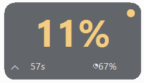
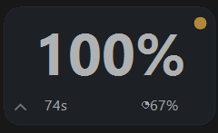
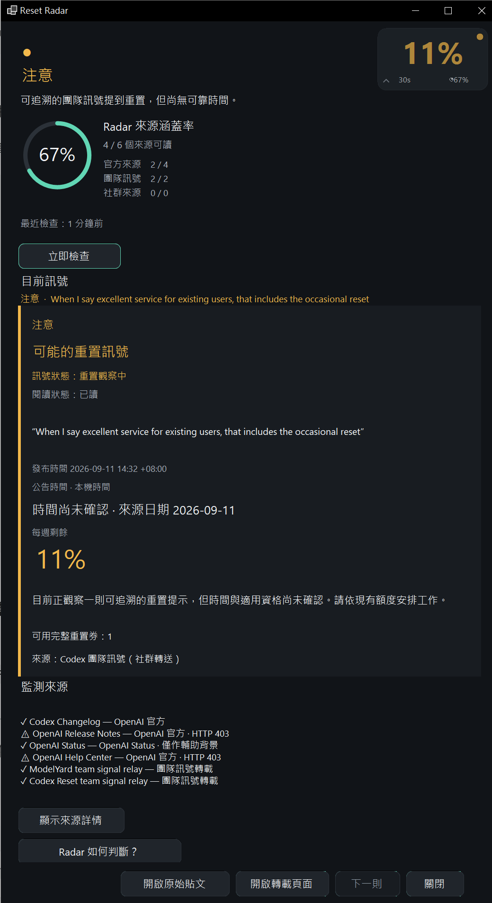
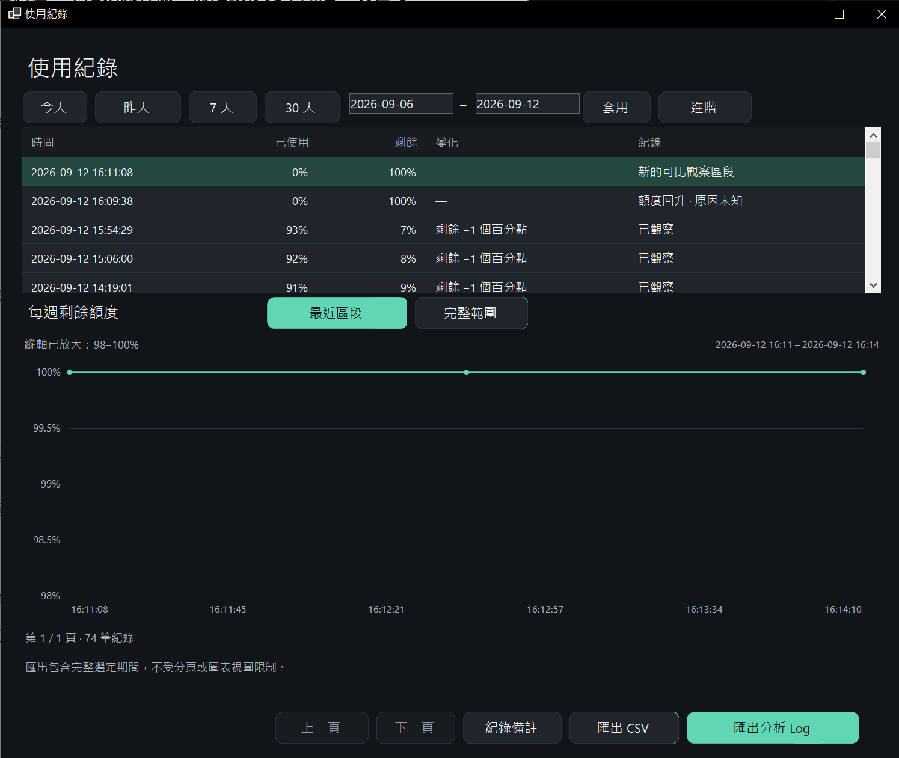
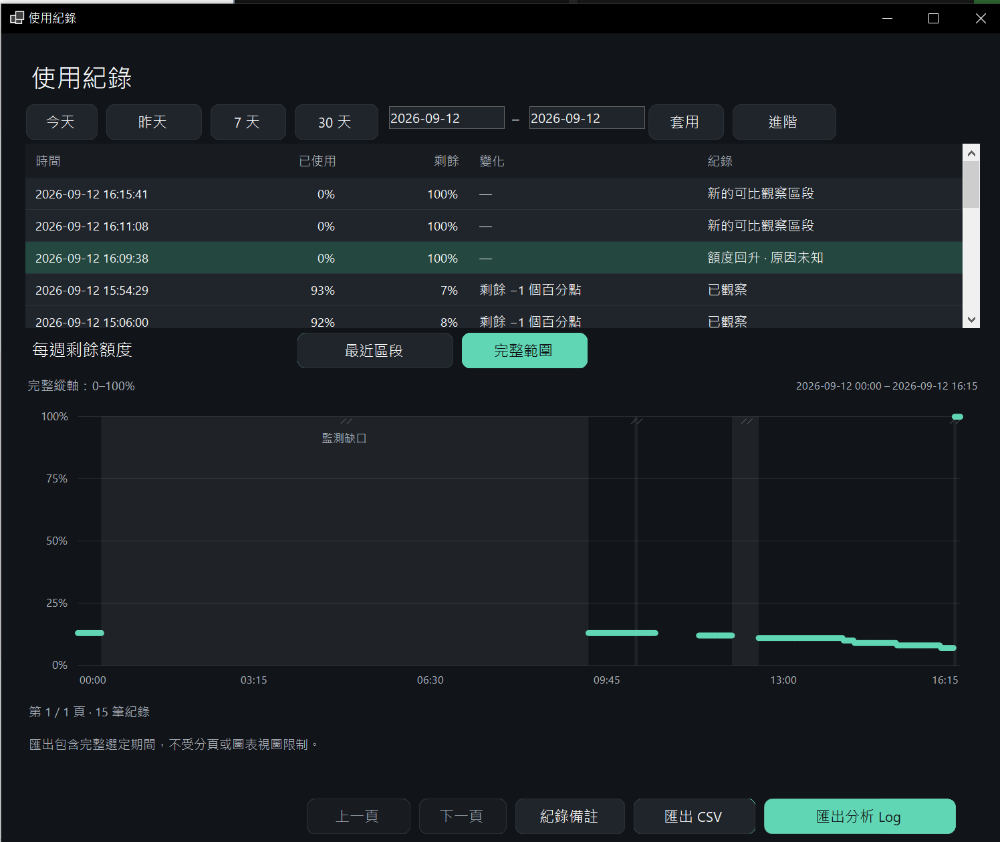

# From an amber light to 7% → 100%

[Back to the project](../../README.md) · [繁體中文](first-reset.zh-TW.md)

I was spending a lot of time making things with Codex—and checking the Usage page. Eventually I put that number in a small desktop overlay, then added local history and a few reset-news sources.

On September 12, there was an amber WATCH message: the team had mentioned occasional resets, without reliable timing. The dot stayed after I read it. I still had one full reset credit and held off on using it.

Later, people in a Codex Facebook group shared more specific news and worked out the local time. I kept using the quota I had and paid attention to the updates.

It went down to **7%**. The next time I looked, it was **100%**.

The credit was still there. That was a very satisfying number to see. 😄

*The amber dot was still visible in that old build. Retiring the old reminder after replenishment was fixed later. This is the original image, not an edited version of how I wish it had looked.*

## Helpful, but not a prediction

The more specific information came from the community. The tool recorded a WATCH and the quota change; it **did not demonstrate a timely INCOMING alert for the later explicit announcement**. It did not predict the reset time.

The early message was already circulating online, so this is not a claim that the app beat my first discovery on social media. It gave me a visible nudge and a local record. That is useful enough without turning it into a bigger story.

The 67% reading meant four of six configured sources were readable. It was not a reset probability. The team message arrived through a community relay; relays can be late, miss posts or repeat each other.

## What the local record shows

The existing history was checked read-only. Times below are Taiwan time, UTC+8.

| Observation | Value |
| --- | --- |
| Last sample before replenishment | September 12, 2026, 16:08:07 — 7% remaining |
| First sample after replenishment | September 12, 2026, 16:09:38 — 100% remaining |
| Change | +93 percentage points |
| Full reset credits | 1 before; 1 after |
| Next reset date reported by the source | Moved from September 15 to September 19 |
| Cause | Unknown; this local record alone does not prove a global cause |

16:09:38 is the **first local observation of a full quota**, not an exact server-side execution time. The change occurred within the sampling interval. An earlier informal mention of 15:11 did not match the retained record; we do not use it to claim an eleven-minute prediction error.

The 15:54 row was an earlier percentage-change entry. The underlying samples also included a 7% reading at 16:08:07, narrowing the observation interval.

The full day, including monitoring gaps

## Making the result easier to find

The September 13 Gold interface puts a small gold event summary above the chart, rather than over the data. Relevant old-cycle reminders retire after the local cycle is satisfied, while the original message and read history remain available.

*This is the later accepted interface, not what the tool looked like during the original reset.*

This is one real example, not a completed 72-hour soak test or proof that every future announcement will be detected. New features are paused for now. I would rather use this version for a while.
